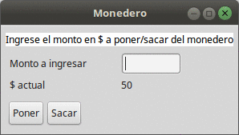

# Ejercicio Manejo de errores - Monedero

 

# Ejercicio Manejo de Errores - Monedero

 

 

## Dominio y explicación
Ejercicio del [monedero](https://docs.google.com/document/d/1vVW91adl0p-NxGNpe8fqmC_5YmBkrxaLDFKyZ0xZb9Y/edit)

## Cómo correr el ejemplo

En el directorio raíz encontrarán el archivo [MonederoApplication.launch](MonederoApplication.launch) que levanta la aplicación en [Arena](arena.uqbar-project.org), un framework didáctico que nos sirve como excusa para mostrar cómo se capturan los errores que lanza el negocio, ya que como vemos cuando un objeto de dominio lanza un error lo suele atrapar

* la interfaz de usuario
* un test unitario
* o en muy excepcionales casos, otro objeto de dominio (porque hay una regla de negocio que contempla el manejo específico de errores) 

## Conceptos a ver

- Manejo de errores
- Refactor de algunas decisiones iniciales de diseño
- Implementación de una UI sencilla utilizando el framework [Arena](http://arena.uqbar-project.org/)

> **NOTA IMPORTANTE**: este ejemplo solo funciona con una JDK 1.8

	
